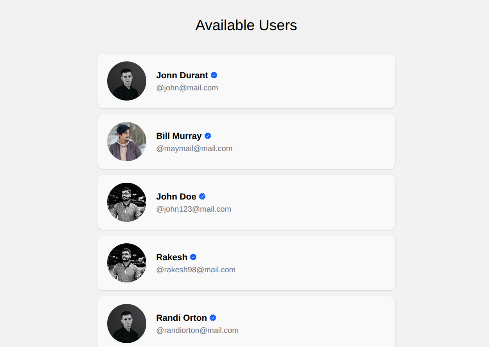

# Backend with Express JS

Program CRUD data users menggunakan framework Express js

### Features:
- Get all data users
- Pagination
- Search users
- Sorting
- Create data user
- Update data users
- Upload profile picture
- Delete data user
- Get user detail

### API Endpoints

| Method | Endpoint | 
|--------|----------|
| GET | /users |
| GET | /users/:id |
| POST | /register |
| PUT | /users/:id |
| PUT | /users/:id/upload |
| DELETE | /users/:id |

### Preview:

